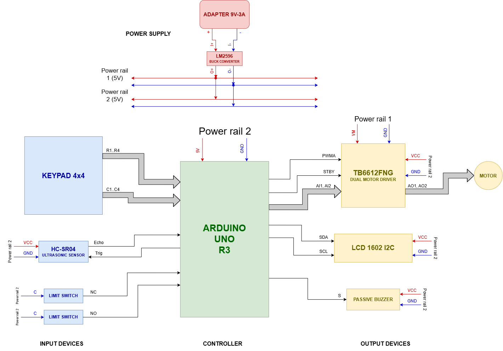
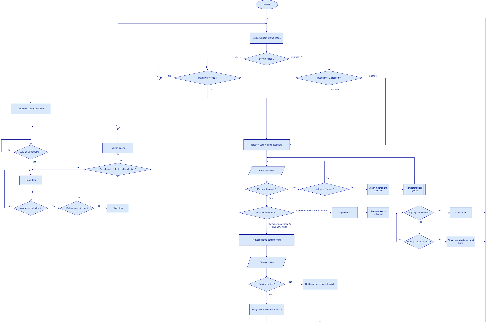
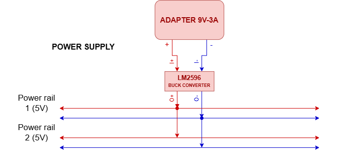

# Embedded Dual-Mode Automatic Door Control and Security System

A small embedded-system project built with an **Arduino UNO R3** to control a motorized door in two operating modes:

* **Auto Mode** — the door opens automatically when an object is detected.
* **Security Mode** — opening the door requires password authentication.

The system uses an ultrasonic sensor for object detection, mechanical limit switches for door-position feedback, and a TB6612FNG motor driver for DC motor control. A 16×2 I2C LCD and a passive buzzer provide basic user feedback.

This project is developed as an **academic embedded-systems prototype**, focusing on system-level integration, design decisions, and the interaction between sensors, the actuator, the microcontroller, and state-based control logic rather than production-level safety or security requirements.

---

## 1. System Overview

The main controller is an Arduino UNO R3.

### Main components

| Component                    | Function                                      |
| ---------------------------- | --------------------------------------------- |
| Arduino UNO R3               | Main controller                               |
| 4×4 matrix keypad            | User input and password entry                 |
| HC-SR04                      | Object detection                              |
| TB6612FNG                    | Dual DC motor driver                          |
| DC motor                     | Door actuation                                |
| 2× mechanical limit switches | Fully-open and fully-closed position feedback |
| 16×2 I2C LCD                 | Display system mode and messages              |
| Passive buzzer               | Key feedback, slow-closing warning, and lockdown alarm |
| 9 V / 3 A adapter            | Main power source                             |
| LM2596 buck converter        | Converts the 9 V input to a 5 V system supply     |

The firmware is written in Arduino C++ using the `Keypad` and `LiquidCrystal_I2C` libraries.

---

## 2. Product Motivation

The idea for this project comes from combining two common types of door systems:

- **Automatic doors**, such as those commonly used at supermarkets and other public entrances, where convenient hands-free access is the primary requirement.
- **Security-controlled doors**, such as those used in offices, apartment buildings, and restricted areas, where access authentication is more important than automatic opening.

These two types of systems serve different purposes and therefore use different control strategies. Automatic doors prioritize convenience and continuous sensor-based operation, while security-controlled doors prioritize authorized access and controlled operation.

This project explores the idea of combining these two common types of door systems into a unified system with two distinct operating modes:

- **Auto Mode** provides convenient, sensor-driven automatic operation for normal access.
- **Security Mode** provides password-authenticated access and controlled door operation when access restriction is required.

The two modes represent different control behaviors rather than simply different ways of interacting with the system. Each mode has its own control logic, sensing behavior, and access conditions.

Combining the two modes into one system provides several advantages:

- The system can support both convenient automatic access and controlled authenticated access within a single door system.
- Automatic sensing can be used when convenience is appropriate while being disabled or restricted when controlled access is required.
- Authentication is required not only for door access but also for mode switching between operating modes.
- The same actuator, door-position feedback, keypad, LCD, buzzer, and control hardware can be shared by both modes while their behavioral control logic remains separated.
- This creates a more integrated control architecture in which different access requirements are handled through explicit operating modes rather than through unrelated conditional behaviors.

The project therefore uses the automatic-door and security-door concepts as a practical basis for exploring how different access requirements can be integrated into a single embedded control system.

---

## 3. Hardware Architecture

The system is divided into three main parts:

```text
INPUT DEVICES  →  CONTROLLER  →  OUTPUT DEVICES
                     |
                 Arduino UNO
```

### Input devices

* 4×4 matrix keypad
* HC-SR04 ultrasonic sensor
* Open-position limit switch
* Closed-position limit switch

### Controller

* Arduino UNO R3

The Arduino reads the sensors, keypad and limit-switch inputs, determines the current system and door states, and generates the required control signals.

### Output devices

* TB6612FNG motor driver
* DC motor
* 16×2 I2C LCD
* Passive buzzer

The motor driver is controlled by two direction signals and one PWM speed signal from the Arduino.

---

## 4. Power Supply

The system uses a **9 V / 3 A external adapter** as the main power source.

```text
9 V / 3 A Adapter
        │
        ▼
   LM2596 Buck
     Converter
        │
        ▼
      5 V
   ┌────┴────┐
   ▼         ▼
Rail 1     Rail 2
  5 V        5 V
```

The LM2596 converts the 9 V input to approximately 5 V.

The project diagram shows two 5 V power rails. These are **two distribution rails from the same LM2596 output**, not two independent voltage sources.

* **Power rail 1** is mainly used for the TB6612FNG motor-driver supply.
* **Power rail 2** supplies the Arduino-side peripherals such as the HC-SR04, LCD, and buzzer.

The grounds are shared between the circuits.

> **Note**: The actual motor supply in this prototype is also derived from the 5 V rail. The suitability of this supply depends on the selected DC motor and its current requirements.

---

## 5. Hardware Block Diagram



The block diagram shows the connection between the input devices, Arduino UNO, motor driver, and output devices.

The Arduino communicates with:

* Keypad through digital I/O
* HC-SR04 through `Trig` and `Echo`
* Limit switches through digital inputs
* TB6612FNG through direction and PWM control signals
* LCD through I2C
* Buzzer through a digital/PWM-capable output

---

## 6. Arduino Pin Assignment

The current firmware uses the following Arduino UNO R3 pins.

| Arduino pin | Connected device    | Function              |
| ----------- | ------------------- | --------------------- |
| A0 / 14     | Keypad              | Row 1                 |
| A1 / 15     | HC-SR04             | Trigger               |
| A2 / 16     | HC-SR04             | Echo                  |
| A3 / 17     | TB6612FNG           | Motor input 1         |
| D2          | Keypad              | Column 3              |
| D3          | Open limit switch   | Fully-open position   |
| D4          | Closed limit switch | Fully-closed position |
| D5          | TB6612FNG           | PWM motor speed       |
| D6          | Passive buzzer      | Buzzer signal         |
| D7          | Keypad              | Column 4              |
| D8          | Keypad              | Row 4                 |
| D9          | Keypad              | Row 3                 |
| D10         | TB6612FNG           | Motor input 2         |
| D11         | Keypad              | Column 2              |
| D12         | Keypad              | Row 2                 |
| D13         | Keypad              | Column 1              |

The LCD uses the Arduino I2C interface.

The two limit switches use the Arduino's internal pull-up resistors:

```cpp
pinMode(doorOpenSwitch, INPUT_PULLUP);
pinMode(doorCloseSwitch, INPUT_PULLUP);
```

Therefore, a pressed switch is read as `LOW`.

---

## 7. Operating Modes

The firmware implements two operating modes.

### Auto Mode

In Auto Mode, the ultrasonic sensor HC-SR04 is used to detect an object near the door.

Ultrasonic sensing is controlled through the `isUltrasonicEnabled` flag:

```cpp
bool isUltrasonicEnabled = true;
```

This flag determines whether ultrasonic measurements are allowed to participate in the automatic door-control logic. In Auto Mode, ultrasonic sensing is **enabled** by default and is used to trigger door opening when any object is detected.

Control flow:

```text
     Door closed                                    
         │                                          
┌──────► │                                          
│        ▼                                          
│  Object detected?                                 
│    |            |                                 
│   No           Yes                                
│    │            │                                 
└────┘            ▼                                 
               Open door                            
                  │                                 
                  ▼                                 
              Door fully opened                     
      ┌─────────► │                                 
      │           ▼                                 
      │    Object still detected?                   
      │       |             |                       
      │      Yes           No                       
      │       │             │                       
      │       ▼             ▼                       
      │     Reset         Wait 2                    
      │     timer         seconds                   
      │       │             │                       
      └───────┘             ▼                       
                         Close door                 
                            │                       
                            ▼                       
                         Obstacle detected          
                         while closing?             
                          |          |              
                         Yes        No              
                          │          │              
                          ▼          ▼              
                      Stop and     Door fully closed
                    reopen door                      
```

The configured detection distance is approximately **17 cm**.

```cpp
if(0 < distance && distance < 17) {
    return true;
}
```


When the door is fully open:

* The timer is reset while an object remains in the detection zone.
* If no object is detected for **2 seconds**, the door starts closing.

During normal closing:

* If an object is detected, the motor is stopped.
* The door is then commanded to reopen.

This provides a simple obstacle-response mechanism.

---

### Security Mode

Security Mode requires password authentication for controlled door access.

When the door is fully closed, the keypad provides dedicated function keys for different user actions:

* `B` selects door access authentication.
* `C` selects system-mode change.
* The user enters a four-digit password.
* `D` submits the entered password for verification.
* `A` deletes the most recently entered digit.

A successful password for door access opens the door.

While the door is fully closed in Security Mode, ultrasonic sensing is **disabled** for automatic door opening; door opening requires successful password authentication through the keypad.

---

## 8. Security Mode Door Closing

After the door has been opened in Security Mode, the system monitors the ultrasonic sensor while the door remains **fully open**.

If an object is detected, the system immediately starts normal-speed closing.
If no object is detected for **10 seconds**, the system starts a slow-closing procedure with an audible warning.

Before closing begins, ultrasonic sensing is **temporarily disabled** so that the closing operation is handled by the door-control logic rather than being repeatedly triggered by automatic object detection.

```cpp
if (isObjectDetected() == true) {
    isUltrasonicEnabled = false;
    closeDoorNormally();
}
else {
    if (millis() - doorOpenedTime >= 10000) {
        isUltrasonicEnabled = false;
        closeDoorSlowly();
    }
}
```

During slow closing:

* Motor PWM is reduced to approximately 90.
* The buzzer produces a periodic warning.
* The closed-position limit switch stops the motor when the door reaches the fully closed position.
* The warning is disabled when the door reaches the closed position.

The warning pattern is:

`BEEP → SILENCE → BEEP → SILENCE → ...`

Each sound and silence interval is approximately 500 ms.

---
## 10. Operating Mode Switching

The operating mode can be changed through the keypad-based authentication and confirmation process.

In Auto Mode, pressing `C` initiates a request to switch the operating mode. The firmware temporarily disables ultrasonic sensing and enters the password-entry state.

```cpp
if(key == 'C') {
    isUltrasonicEnabled = false;
    enteringPurpose = SWITCH_SYSTEM_MODE;
    keypadAction = PASSWORD_ENTERING;

    requestPassword();
}
```

After successful authentication, the user must explicitly confirm or cancel the change:

```text
* → Confirm
# → Cancel
```

The firmware updates `systemMode` state variable only after confirmation:

```cpp
if(key == '*') {
    if(systemMode == AUTO_MODE) {
        systemMode = SECURITY_MODE;
    }
    else {
        systemMode = AUTO_MODE;
    }
}
```

After the mode switch is completed, the ultrasonic-sensing state is updated to match the newly selected operating mode.

```cpp
if(systemMode == AUTO_MODE) {
    isUltrasonicEnabled = true;
}
else {
    isUltrasonicEnabled = false;
}
```


This creates a **clearly defined** mode-switching sequence rather than allowing the operating mode to change directly from a single keypad input.

---

## 9. Password and Alarm Logic

The current firmware uses a four-digit password stored directly in the source code.

```cpp
const char defaultPassword[] = "1234";
```

The password is not encrypted or hashed.

Password authentication is associated with a specific system operation through an explicit authentication purpose. The firmware distinguishes between requests to open the door and requests to switch the system operating mode.

```cpp
enum ENTERING_PURPOSE {
    OPEN_DOOR,
    SWITCH_SYSTEM_MODE,
    NONE
};
```

After successful authentication, `verifyPassword()` determines the appropriate next action based on the authentication purpose, allowing the same authentication mechanism to support different system operations.

```cpp
if (enteringPurpose == SWITCH_SYSTEM_MODE) {
    keypadAction = SWITCH_CONFIRMATION;
    requestConfirm();
}
else {
    if (doorBehavior == CLOSED_COMPLETELY && systemMode == SECURITY_MODE) {
        openDoorNormally();
    }
}
```

Failed authentication attempts produce an audible indication. After repeated failures, the alarm sequence is activated.

```cpp
if (attempts < 4) {
    // Indicate failed authentication.
}
else {
    activateAlarm();
    attempts = 0;
}
```

The alarm:

* Displays a system alarm message on the LCD.
* Activates the buzzer.
* Runs for approximately 10 seconds.
* Temporarily represents a lockdown state.

This is intended as a simple demonstration of password-based authentication, purpose-dependent access control, and failed-authentication handling with an alarm/lockdown response, rather than a secure access-control implementation for real-world deployment.

---

## 11. Firmware Structure

Instead of implementing all behavior in one large routine, the firmware separates several concepts into enumerated states.

### System mode

```cpp
enum SYSTEM_MODE {
    AUTO_MODE,
    SECURITY_MODE
};
```

### Keypad interaction

```cpp
enum KEYPAD_ACTION {
    KEYPRESS_AWAITING,
    PASSWORD_ENTERING,
    SWITCH_CONFIRMATION
};
```

### Authentication purpose

```cpp
enum ENTERING_PURPOSE {
    OPEN_DOOR,
    SWITCH_SYSTEM_MODE,
    NONE
};
```

### Door behavior

```cpp
enum DOOR_BEHAVIOR {
    OPENED_COMPLETELY,
    OPENING_NORMALLY,
    CLOSING_NORMALLY,
    CLOSING_SLOWLY,
    CLOSED_COMPLETELY,
    EMERGENCY_STOPPED
};
```

This separation prevents unrelated behaviors from being mixed together while keeping state-dependent control logic structured, clear, and maintainable.

The main loop determines the current system mode and transfer control to the appropriate mode-specific routine:

```cpp
if (systemMode == SECURITY_MODE) {
    processSecurityMode(key);
}
else {
    processAutoMode(key);
}
```

---

## 12. Main Control Functions

Some of the main firmware functions are:

| Function                | Purpose                            |
| ----------------------- | ---------------------------------- |
| `processAutoMode()`     | Handles Auto Mode behavior         |
| `processSecurityMode()` | Handles Security Mode behavior     |
| `isObjectDetected()`    | Measures distance using HC-SR04    |
| `openDoorNormally()`    | Starts or continues normal opening |
| `closeDoorNormally()`   | Starts or continues normal closing |
| `closeDoorSlowly()`     | Performs slow closing with audible warning |
| `emergencyStop()`       | Stops motor motion immediately                |
| `verifyPassword()`      | Checks the entered password        |
| `activateAlarm()`       | Runs the alarm sequence            |
| `confirmModeSwitch()`   | Handles mode-switch confirmation   |

---

## 13. Door Position Feedback

Two mechanical limit switches provide feedback about the door's end positions:

```text
                 Door movement
                     │
        ┌────────────┴────────────┐
        ▼                         ▼
  Open limit switch        Close limit switch
        │                         │
        └────────── Arduino ──────┘
```

The switches allow the firmware to determine when the door has reached:

* Fully open
* Fully closed

The Arduino uses `INPUT_PULLUP`, so the corresponding input becomes `LOW` when the switch is pressed.

This prevents the motor from continuing to run after the door reaches an end position.

---

## 14. System Flowchart



The flowchart describes the main behavior of the firmware, including:

* System initialization and startup
* Auto Mode operation
* Object detection and presence monitoring
* Automatic door opening
* Fully-open and fully-close door detection
* Door-open holding and configurable timeout
* Automatic door closing
* Obstacle detection during door closing
* Automatic reopening after obstacle detection
* Security Mode operation
* Password authentication
* Authentication failure handling
* Failed-attempt tracking and alarm activation
* Authenticated door access
* Door opening and closing after successful authentication
* System-mode switching
* Timer management and reset
* Sensor and actuator control
* Behavioral-state management using enumerated states
* Continuous firmware execution through the Arduino loop() function

The implementation is based on repeated execution of the Arduino `loop()` function rather than a separate real-time operating system.

---

## 15. Power Architecture



The 5 V supply is distributed through two separate 5V power rails, with one rail dedicated primarily to the motor-driver side and the other serving the controller and peripheral devices.

The separate power-distribution paths help reduce the impact of motor-related current fluctuations and electrical noise on the controller and peripheral devices.

### Power rail 1

Used primarily for the motor-driver side:

```text
LM2596 5 V
    │
    ▼
Power rail 1
    │
    └── TB6612FNG VM
```

### Power rail 2

Used for the controller and peripheral devices:

```text
LM2596 5 V
    │
    ▼
Power rail 2
    ├── HC-SR04
    ├── LCD
    ├── Passive buzzer
    └── Arduino-side circuits
```

Both rails originate from the same LM2596 output and share the system ground.

---

## 16. Libraries

The firmware currently uses:

```cpp
#include <LiquidCrystal_I2C.h>
#include <Keypad.h>
```

These libraries are used for:

* `LiquidCrystal_I2C` — communication with the 16×2 I2C LCD.
* `Keypad` — scanning the 4×4 matrix keypad.

---

## 17. Running the Project

### Hardware

Connect the components according to the hardware block diagram and verify the following before powering the system:

1. The LM2596 output is adjusted to approximately 5 V.
2. All circuit grounds are connected correctly.
3. The limit switches are connected according to the `INPUT_PULLUP` configuration.
4. The limit switches must be positioned to prevent the motor from driving the door beyond its intended mechanical limits.
5. The motor driver receives the required supply voltage.
6. The motor current is within the capability of the power supply and motor driver.
7. The motor direction matches the physical opening and closing mechanism.
8. The motor must be powered by a dedicated power supply to prevent motor current and electrical noise from affecting the other system components.

### Firmware

1. Open the `.ino` file in Arduino IDE.
2. Install the required libraries.
3. Select **Arduino UNO** as the board.
4. Select the correct serial port.
5. Upload the firmware.
6. Test the limit switches before running continuous motor operation.

---

## 18. Keypad Layout

The keypad is configured as follows:

```text
┌───┬───┬───┬───┐
│ 1 │ 2 │ 3 │ A │
├───┼───┼───┼───┤
│ 4 │ 5 │ 6 │ B │
├───┼───┼───┼───┤
│ 7 │ 8 │ 9 │ C │
├───┼───┼───┼───┤
│ * │ 0 │ # │ D │
└───┴───┴───┴───┘
```

Key functions:

| Key   | Function                              |
| ----- | ------------------------------------- |
| `0–9` | Enter password digits                 |
| `A`   | Delete the most recently entered digit |
| `B`   | Request door opening through access authentication in Security Mode |
| `C`   | Request operating-mode switch         |
| `D`   | Submit the entered password for verification  |
| `*`   | Confirm the mode switch               |
| `#`   | Cancel the mode switch                |

---

## 19. Current Limitations

This project is a prototype for studying embedded control and does not provide the safety or security features expected from a real automatic door.

Some current limitations are:

* The password is stored directly in the firmware.
* There is no cryptographic authentication.
* The HC-SR04 is used as the main obstacle-detection sensor.
* There is no independent hardware emergency-stop circuit.
* The motor power system is simplified for the prototype.
* The firmware uses blocking functions such as `delay()` and `pulseIn()`.
* The system does not include a dedicated real-time operating system.
* Mechanical and electrical protection depends on the prototype hardware.

These limitations are acceptable for a student project, but they would need to be addressed before using a similar design in a real access-control or safety-critical application.

---

## 20. Project Structure

The current project is intentionally kept relatively small:

```text
embedded-dual-mode-automatic-door-control/
│
├── README.md
├── LICENSE
├── .gitignore
│
├── docs/
│   └── images/
│       ├── hardware-block-diagram.png
│       ├── power-architecture.png
│       └── system-flowchart.png
│
├── firmware/
│   └── embedded_dual_mode_automatic_door_control_security_system.ino
│
└── media/
```

The firmware is currently contained in a single Arduino `.ino` file because the project is small enough that splitting it into multiple source modules is not necessary yet.

---

## 21. Project Purpose

The main purpose of this project is to practice the design of a small embedded control system by integrating:

- Digital input handling
- Sensor interfacing
- Motor control and PWM
- I2C communication
- Keypad scanning
- User-interface feedback
- State-based control logic
- Operating-mode-dependent system behavior
- Password authentication
- Fault and obstacle handling
- Coordination between multiple hardware peripherals
- Basic consideration of hardware constraints and power requirements

The project focuses on the relationship between hardware behavior and firmware logic, including how multiple peripherals interact to produce predictable system behavior under both normal and abnormal operating conditions.

Rather than simply demonstrating individual Arduino components, the project emphasizes system-level integration, control logic, hardware–firmware interaction, and practical embedded-system design considerations.

---

## License

This project is released under the MIT License. See [`LICENSE`](LICENSE).

---

## Author

**Vu Xuan Thien**

Computer Engineering / Integrated Circuit Design / Embedded Systems
